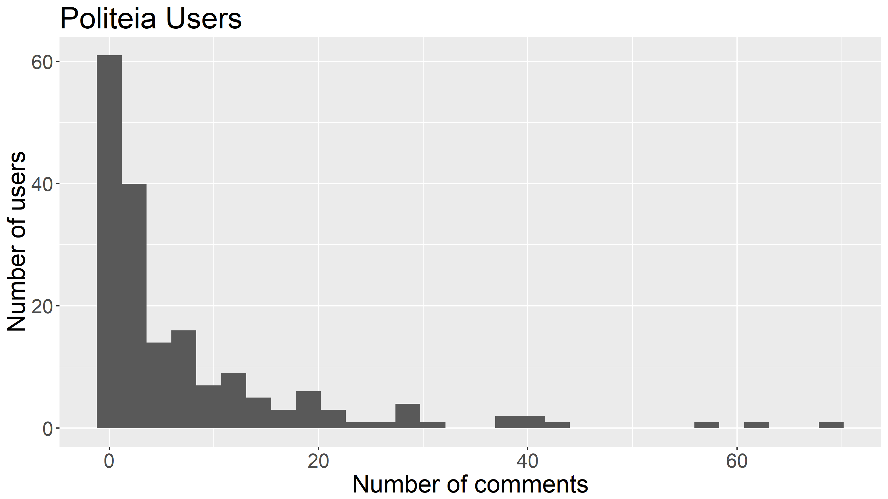
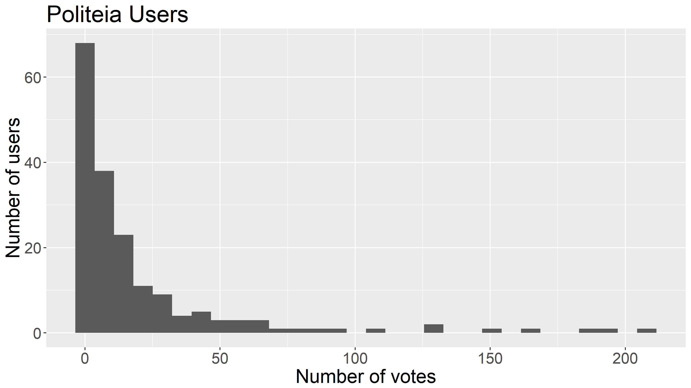
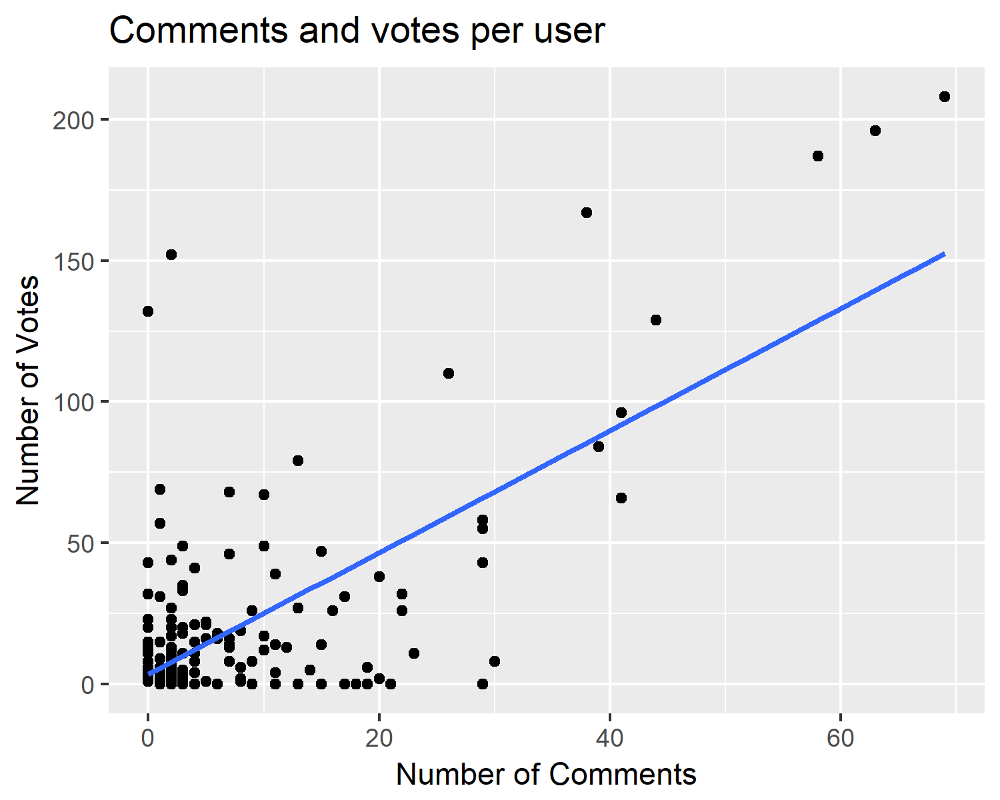
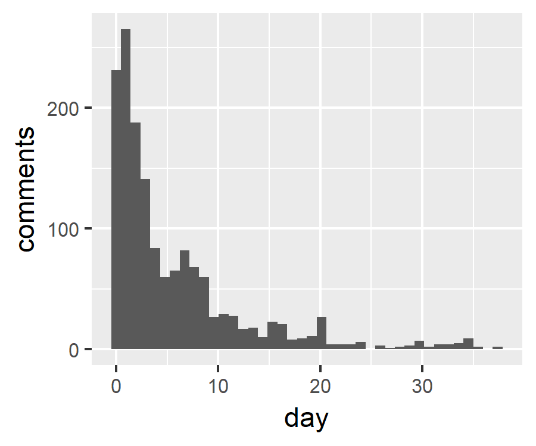
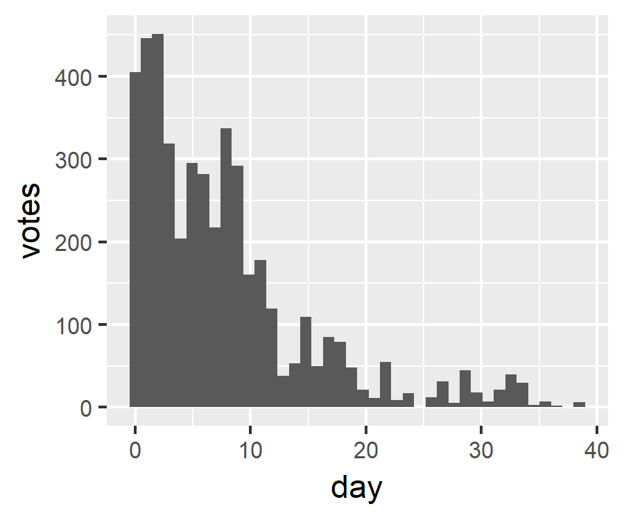

As of Sep 15 2019 on Politeia:

* Proposals that have finished voting have an average (mean) turnout of 31.5%, with a total of 465,220 ticket votes being cast.
* 1,537 comments on Politeia proposals from 151 different users.
*  4,547  up/down votes on comments from  147  different voting users.
* 4,010 upvotes (88%) and 537 downvotes (12%).

- There are a total of 180 users.
- There are 33 users who have commented but not voted.
- There are 29 users who have voted but not commented.
- 28% of comments have been upvoted by their author.

### User votes and comments

These exclude bee, the outlier.

### Timing of votes and comments

These exclude outliers of > 40 days after proposal publication

### Users table

See [here](/data/comments-and-updown-votes/pi-users.csv) for table showing activity per user.

