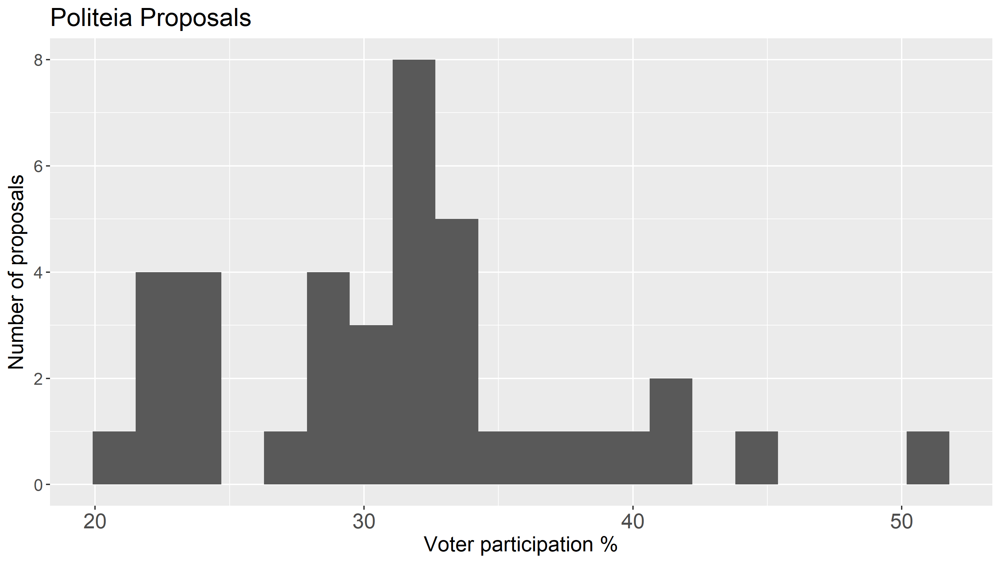
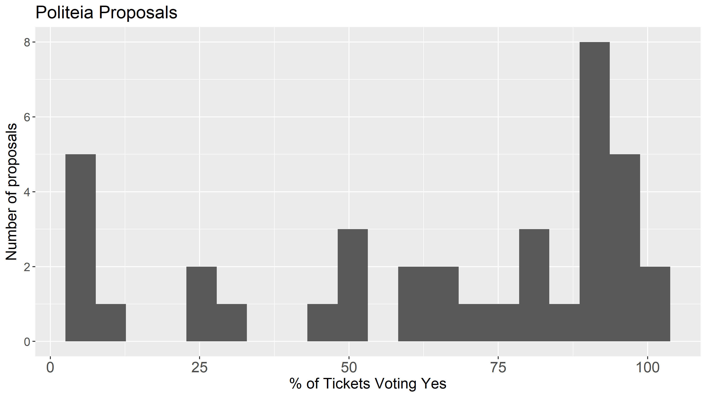
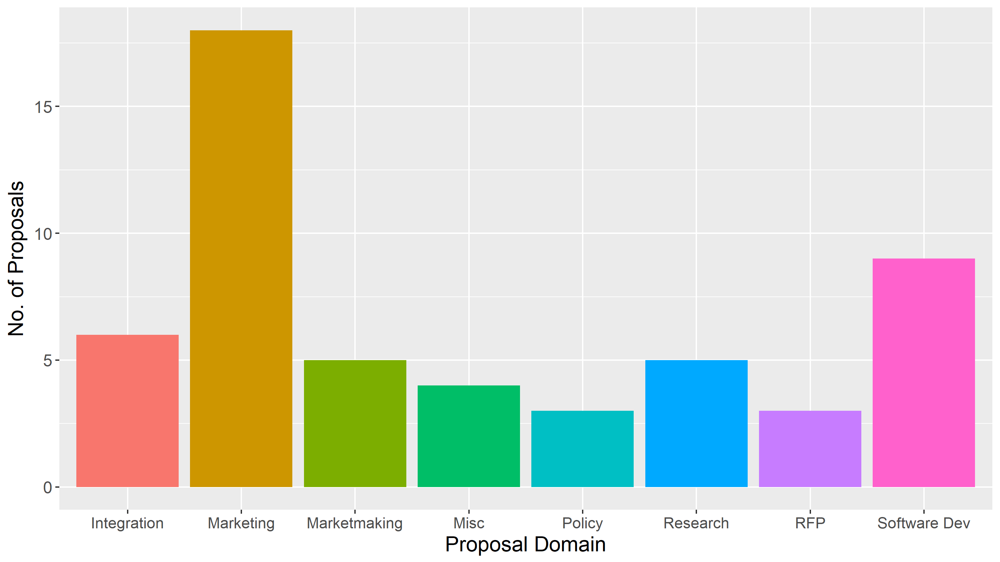
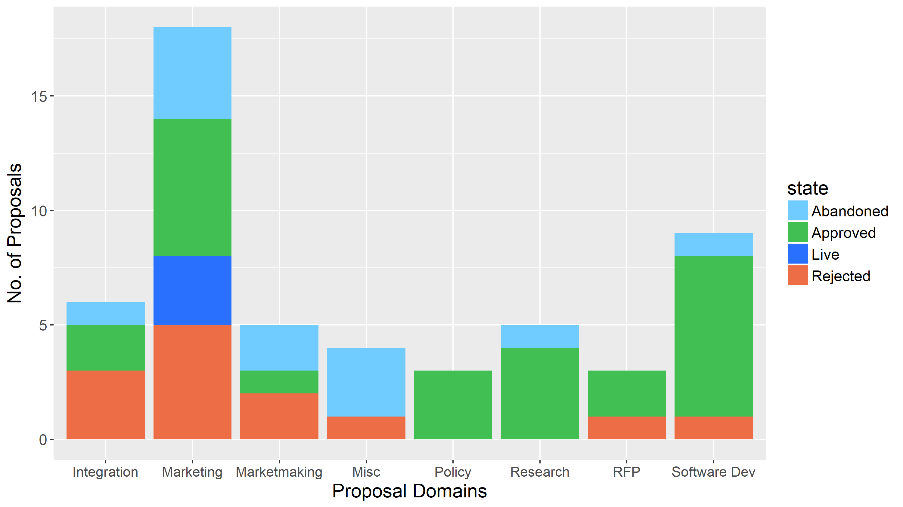
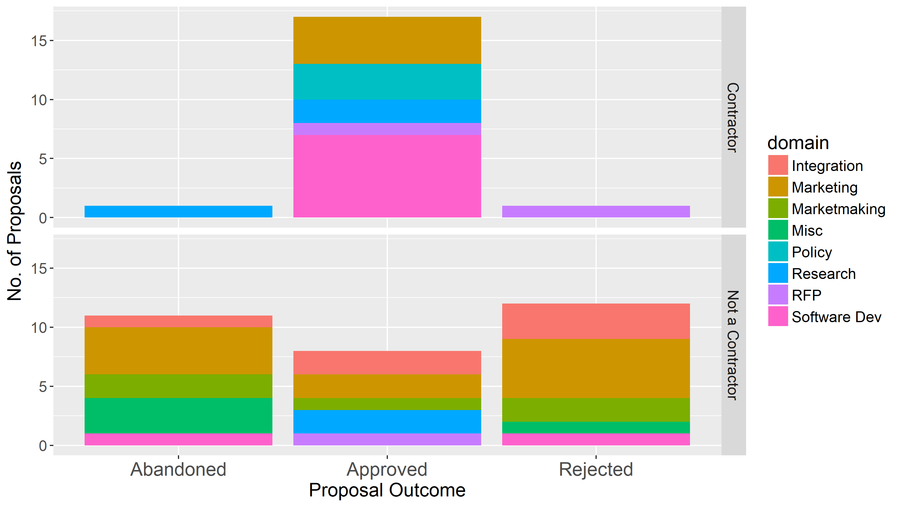
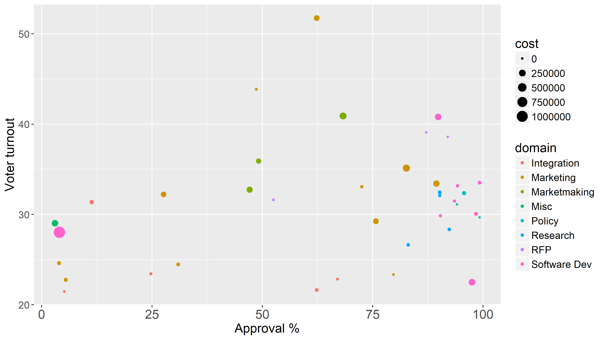

This report presents an overview of Politeia activity data after 1 year. Some new variables have been added to the proposals data-set (proposal cost, domain) and an overview of this data is included.

- 53 proposals have been submitted 
- 38 proposals have been voted on
- Of those, 25 have been approved and 13 rejected
- Proposal votes have an average (mean) turnout of 31.2%, with a total of 486,205 ticket votes being cast.
- 12 proposals have been abandoned before voting started 
- There have been 1,604 comments on Politeia proposals from 154 different users.
- There have been 4,704  up/down votes on comments from  151  different voting users.

There is yet to be a proposal with less than 20% voter turnout, probably related to the minimum quorum requirement of 20%. Above the average the distribution is more stretched, with a number of proposals having >40% turnout and the first Ditto proposal breaking 50%. 

Most of the approved proposals are overwhelmingly approved. The approval threshold is 60%, but 18 of 25 approved proposals had > 80%, 13 had >90% approval.

This is based on my own quick categorization of the proposals. Aside from a lot of marketing proposals no other type dominates the platform.

The functionality to output stats about Treasury spending has not yet been developed for Politeia, so it is not possible to know how much has been paid out for each of the approved proposals so far. The following graph shows the total (maximum) budget approved in each of the domains, but where these budgets have been approved recently it is likely they have not all been spent yet. There are also areas of the project which are not yet well covered by Politeia proposals, like software development, where many of the teams who were working pre-Politeia are still working.

Interesting to note that there are quite a few proposals from people who were already a contractor when they submitted the proposal, around 35% of proposals are from contractors. Proposals from contractors are also more likely to be approved. This is I think quite illustrative of one side of Politeia, where it serves as a way for the stakeholders to give their continued backing to the contractors who are active in important areas and whatever decisions they made which warranted a proposal.

This scatterplot shows all the proposals, positioned according to their turnout and approval, sizes by max cost and colored by domain.

Refreshed standard proposals over time graph

