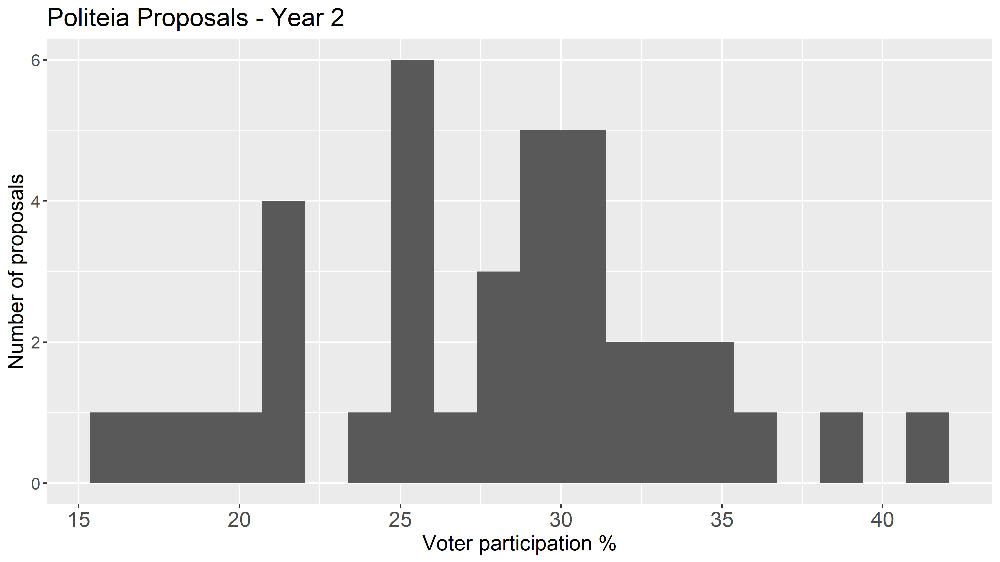
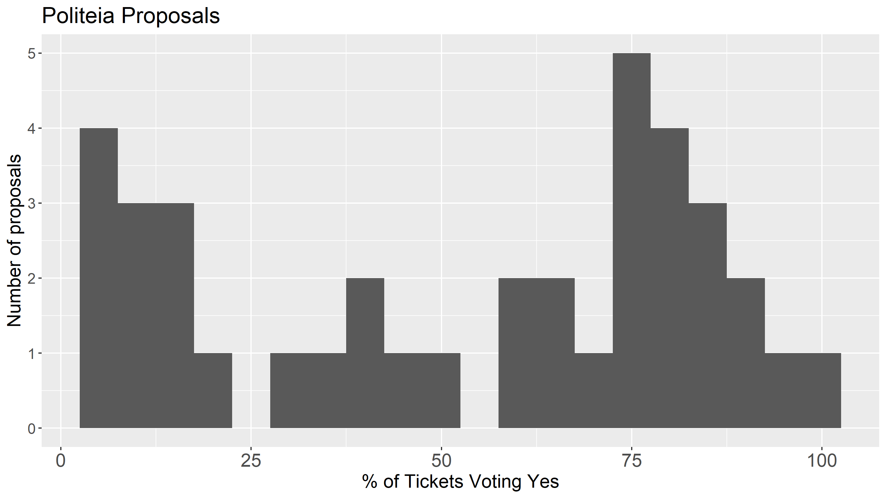
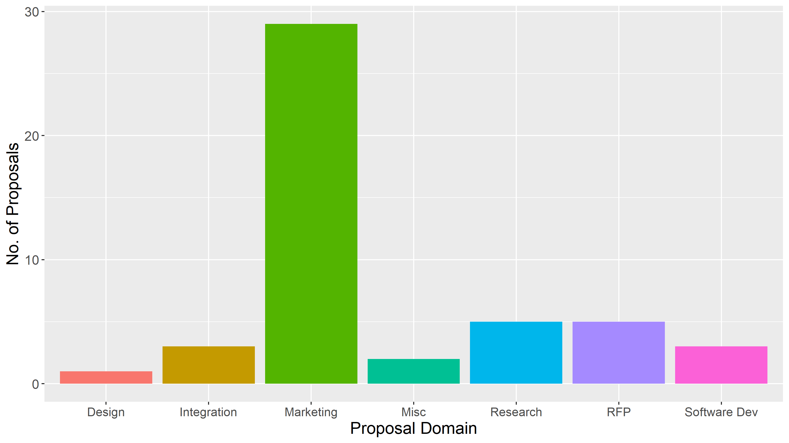
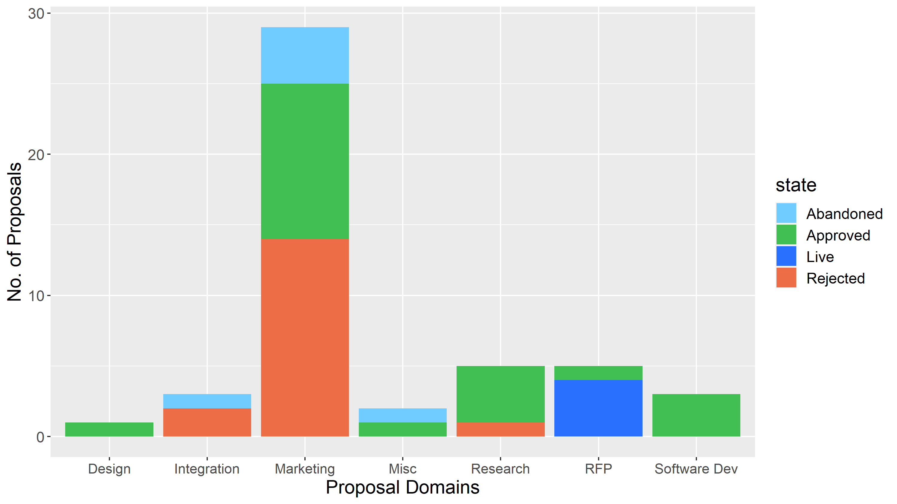
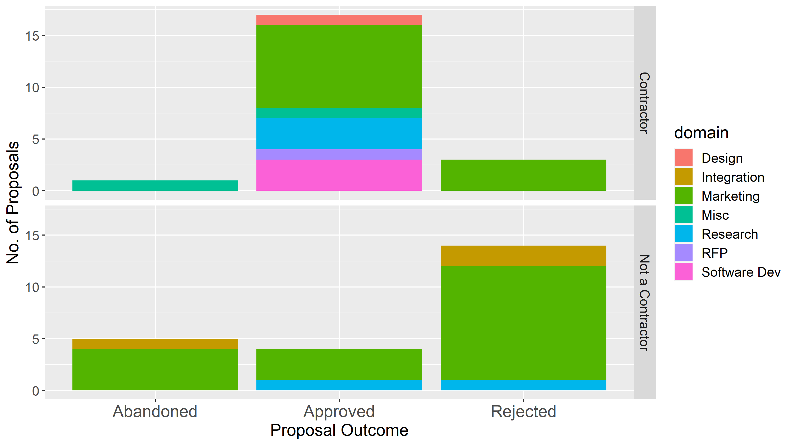
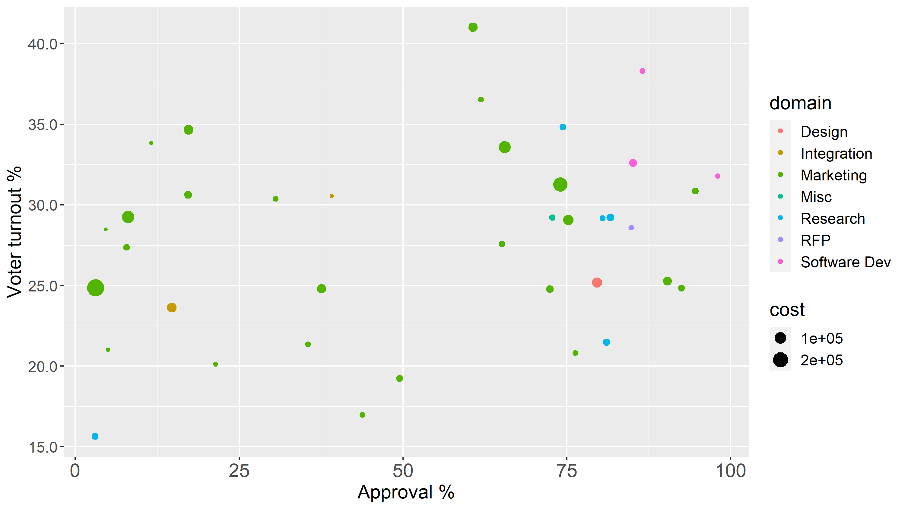
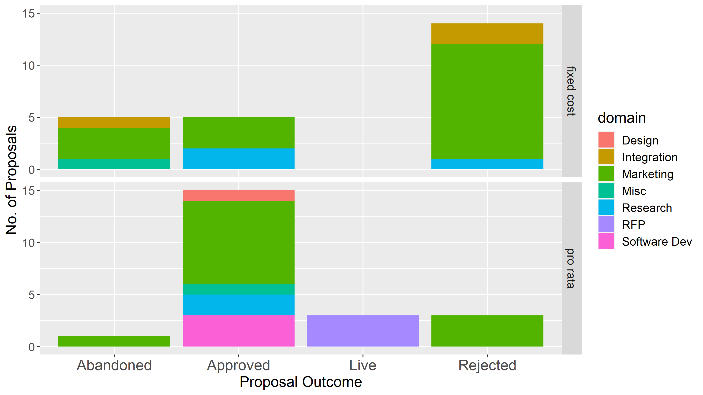
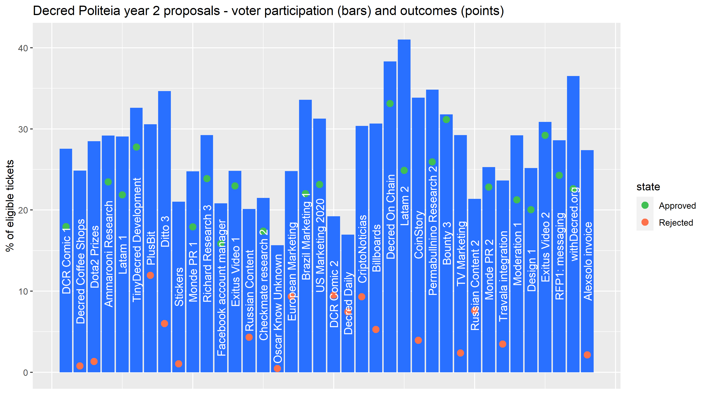

This report presents an overview of Politeia activity data for the second year of its operation (Oct 16 2019 to Oct 16 2020). I have kept the analysis quite similar to last year's [report](https://blockcommons.red/publication/politeia-at-1/), so most of the graphs can be be directly compared with the previous post.

In this time: 

- 46 proposals have been published.
- 38 proposals have been voted on (not counting the 4 being voted on now).
- Of those, 21 have been approved and 17 rejected.
- Proposal votes have an average (mean) turnout of 27.9%, with a total of 431,496 ticket votes being cast.
- 6 proposals have been abandoned before voting started.
- There have been 1,327 comments on Politeia proposals.
- There have been 4,090  up/down votes on comments.

This year saw the first proposals failing to meet the quorum requirement, with 3 proposals failing to reach the required 20% voter participation (they got 15.6% to 19.2% participation and had approval percentages of 3-50%, so also failed on the basis of approval %). The highest turnout (41%) was for the Latam 2 proposal, which narrowly passed (60.7% approval). Mean turnout of 27.9% is down 3.3% on year 1. In terms of medians the turnout was 28.8% in year 2 and 31.4% in year 1, so 2.6% down.

The approval percentages of proposals are generally lower than in year 1. Mean approval % for year 2 proposals that pass was 78.7%, in year 1 this was 85.9%. Mean approval % for rejected year 2 proposals was 20.6%, in year 1 this was 24.2%. Overall, 66% of the ticket votes in year 1 were Yes votes, but this fell to 54% in year 2.

This is based on my own quick categorization of the proposals. Marketing related proposals make up an even greater proportion this year.



Like year 1, marketing proposals have a poor success rate. Integration proposals have also been having a bad year.

The next chart presents the same information but broken down by whether the proposal author was a contractor at the time of the proposal's submission.

This year 48% of the proposals came from contractors (up from 35% in year 1), as with year 1 the proposals from contractors were more likely to be approved.

Part of this increase relates to proposals for renewal of an already-funded effort, which in some cases was how the proposal owner became a contractor in the first place. 10 of the proposals in year 2 were requesting the renewal of funding, and these had an 80% success rate.

This scatterplot shows all the proposals, positioned according to their turnout and approval, size determined by max cost and colored by domain. It does not include Abandoned or Live proposals.

The cost data is based on the maximum cost of the proposal, some have more or less a set fee while others charge at a certain rate per hour and don't expect to spend their full budget. This graph shows that marketing proposals also tend to be more costly than proposals in other domains.

I have also coded up the way the proposals are budgeted, whether as fixed payments (one-time, or per unit for a set number of units) or on a pro rata basis (per hour, up to a maximum).

Before moving on to look at some modelling of proposal success, here's a graph showing all the proposal vote outcomes for the year.

With 99 proposals published, it's getting to the point where models might produce some significant and valid results. I extended the coding of year 1 data to year 2 data, and went back to add new variables like renewal and cost structure to year 1 data. I have collapsed the outcomes to approved and failed (rejected or abandoned), removing the 4 live proposals.

Including variables representing contractor status of proposal owner, cost structure, whether the proposal seeks renewal of a past proposal, and whether payment in arrears was requested - the contractor status of the proposal owner was significant. Contractors proposals were much more likely to be approved, p-value is < 0.001, which means these is less than a 0.1% chance of this pattern being observed without an underlying cause. Proposals which were asking in part for payment in arrears were significantly more likely to be approved (p < 0.01), but this is based on just a handful of proposals from people who had already partially completed the proposed work. None of the other variables showed significant effects.

