# Preview: Please do not share, it is not finished.

This report presents an overview of Politeia activity data for the third year of its operation (Oct 16 2019 to Oct 16 2020).

In this time: 

- 33 proposals have been published.
- 31 proposals have been voted on.
- Of those, 20 have been approved and 11 rejected.
- Proposal votes have an average (mean) turnout of 46%, with a total of 586,311 ticket votes being cast.
- 2 proposals have been abandoned before voting started.
- There have been 660 comments on Politeia proposals.

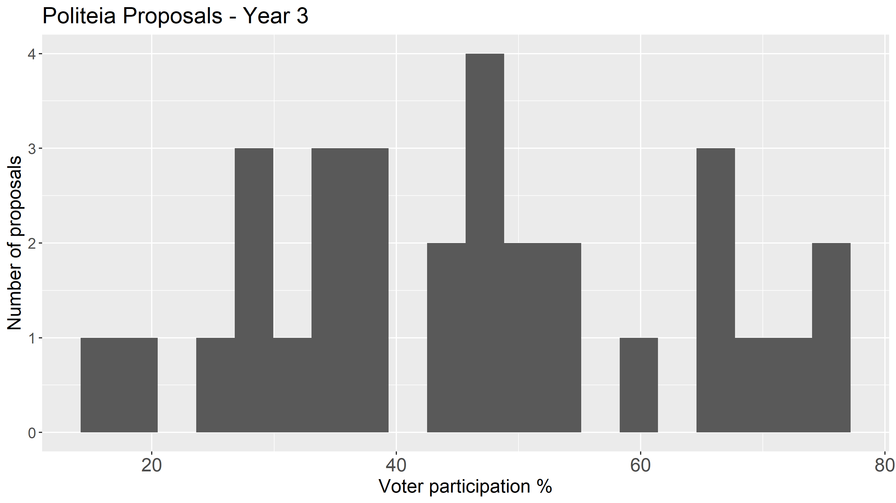

The participation rate has shifted upwards considerably since years 1 (mean 31%) and 2 (mean 28%), and the standard deviation or spread is also larger, although as we will see later there is a temporal dimension to that. There were only two proposals which failed to meet the 20% quorum requirement, and both of them were RFP responses right at the start of the year in question. 

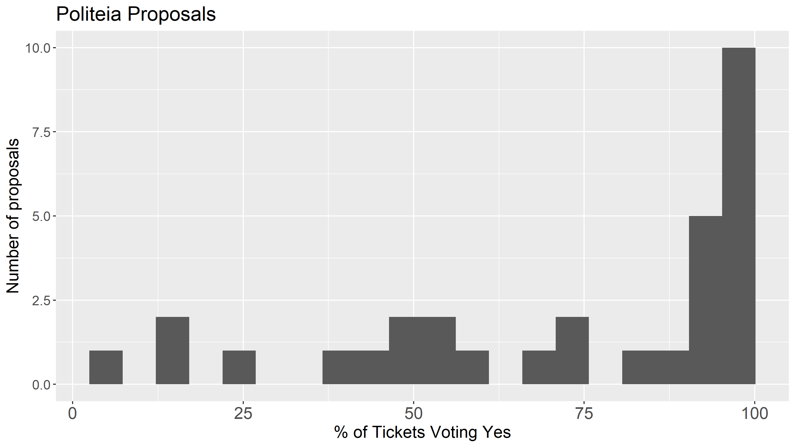

Approval rates for Politeia Proposals

The approval rate of proposals became much more extreme in the third year, with more proposals getting close to 100% approval and those which didn't tending to have quite low approval. The mean approval rate is a little lower at 74% than the previous 79%, whereas the proportion of yes votes has increased to 72% (from 54%). This counterintuitive pattern is a result of high turnout for proposals that got close to 100% approval, with lower turnout for proposals that did not fare well in voting.

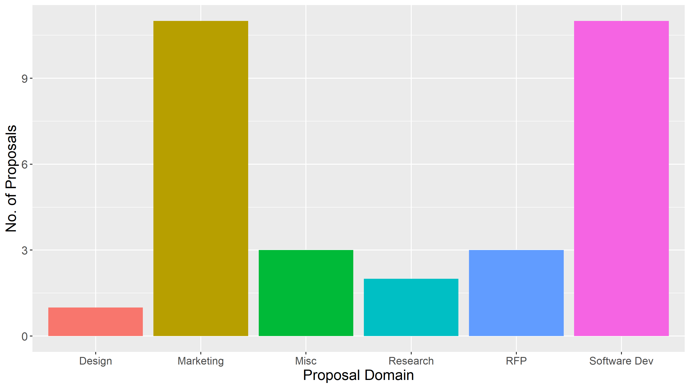

Number of proposals per domain

This is based on my own quick categorization of the proposals. The domination of marketing proposals has reduced, and there were more software development proposals in the third year, so that these rival marketing as the most common type.

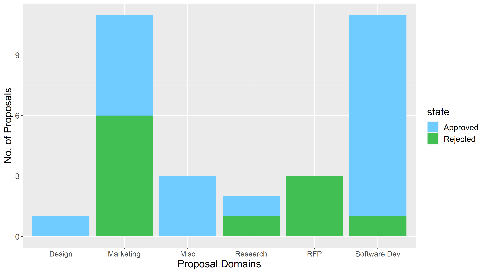

Outcomes for proposals per domain

The approval rate for software development proposals is high, for marketing related proposals it was around 50%.

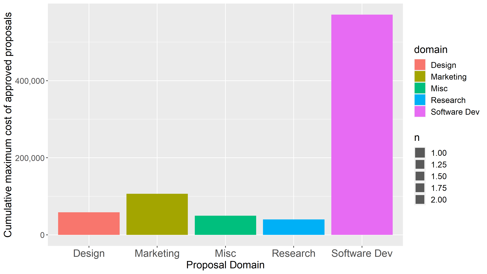

Budget of approved proposals per domain

When we consider the scale of the proposals' budgets, the action has swung even more significantly towards software development.

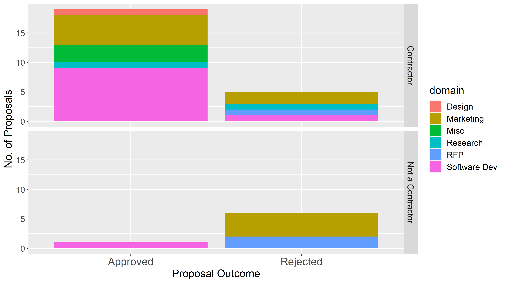

Proposals by contractors and people who were not contractors

The proportion of proposals from people who are already contractors has gone up (from 48% in year 2) to 77%, and in the last year there has only been one proposal from a non-contractor which was approved.

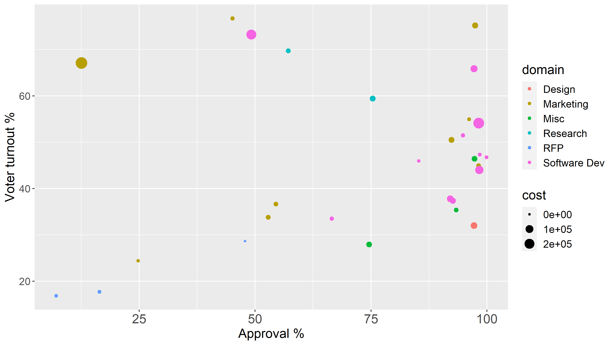

Scatterplot showing approval, turnout, cost and domain for year 2 proposal votes

The software development proposals are getting more numerous, their budgets are getting bigger, and a lot of them are getting strong approval from voters.

Proposal participation and approval rates, ordered by time of vote

This graph shows the temporal dimension to the turnout variability. After a sluggish start with low turnout for the decred.org RFP proposals, voter turnout really picked up, after it crossed the 40% threshold it went on to set new records, and turnout below 40% became rare.

## Longer term trends

With three years of usage and data built up, the attitude of the voting Decred stakeholders towards different types of proposal seems quite clear, but it also feels like it's developed to be that way over time. Let's see if there are any trends in the data which accompany this development.

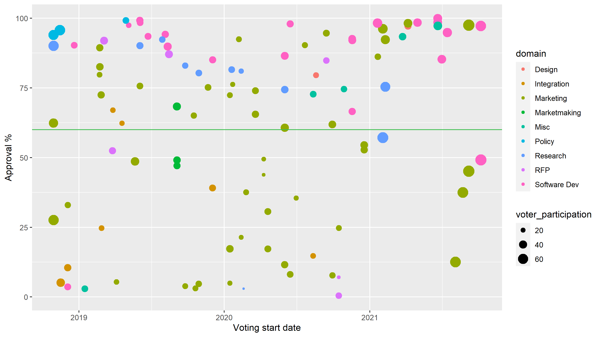

Three years of proposal outcomes: height is approval, colour is domain, and size is voter turnout

From this perspective, it looks like a lot of the (mostly marketing) proposals which tended to get low approval have dried up.

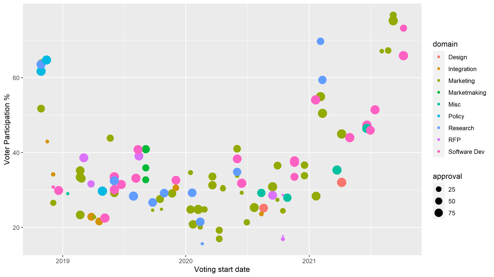

Three years of proposal outcomes: height is voter turnout, colour is domain, and size is approval (proposals that had low approval have small points).

This one has the same data but reverses the y axis and size of the points, it shows a drop in participation after the earliest proposals, then for 2019 and 2020 most of the proposals were in the 20-40% voter turnout range, but since early 2021 the turnout rate has shifted upwards.

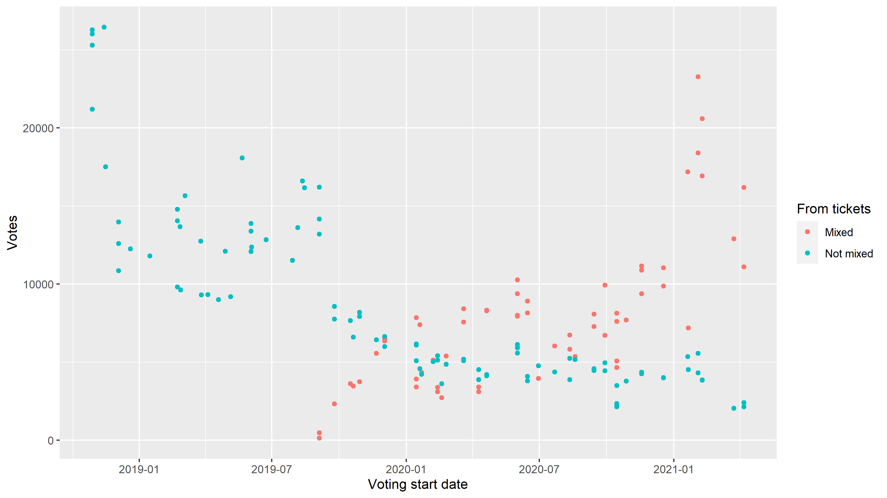

Mixing status of the tickets that voted on Politeia proposals

This graph shows that the number of mixed tickets that vote on Politeia proposals has been increasing, particularly in 2021. The number of unmixed votes on proposals has remained quite flat, and the all time high turnout is down to mixed ticket voters.

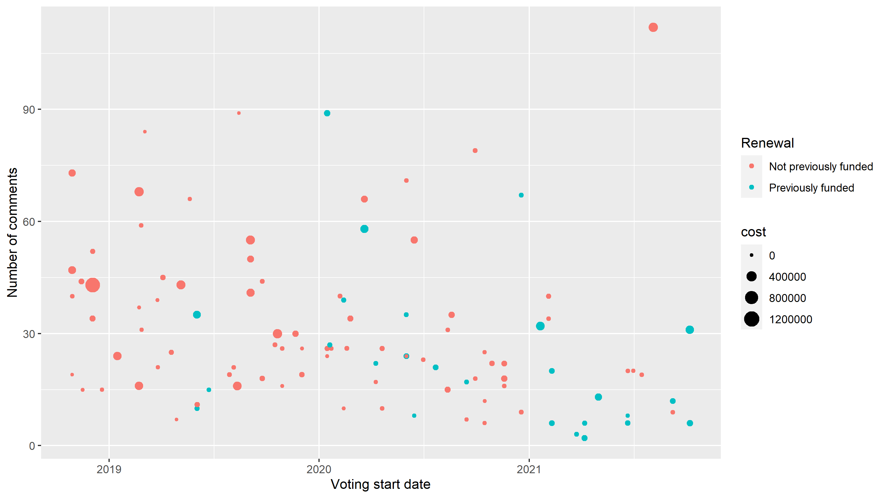

Three years of proposal comments

The number of comments per proposal has dropped in 2021, particularly so for proposals seeking renewal of funding for some activity which is already being funded. Where good progress is being reported and the proposal is on its 3rd or 4th renewal, it is to be expected that the community has less to say in Politeia comments about each iteration. A bug with Politeia comments being duplicated was also resolved in the timeframe where number of comments dropped off, this likely also played a part in the decreasing number of comments.

Stats for Politeia at 3 years:

* 128 proposals published: 66 approved, 42 rejected, 20 abandoned
* 1.56 million ticket votes cast on proposals, 66% Yes
* The proposals received a total of 3,565 comments
