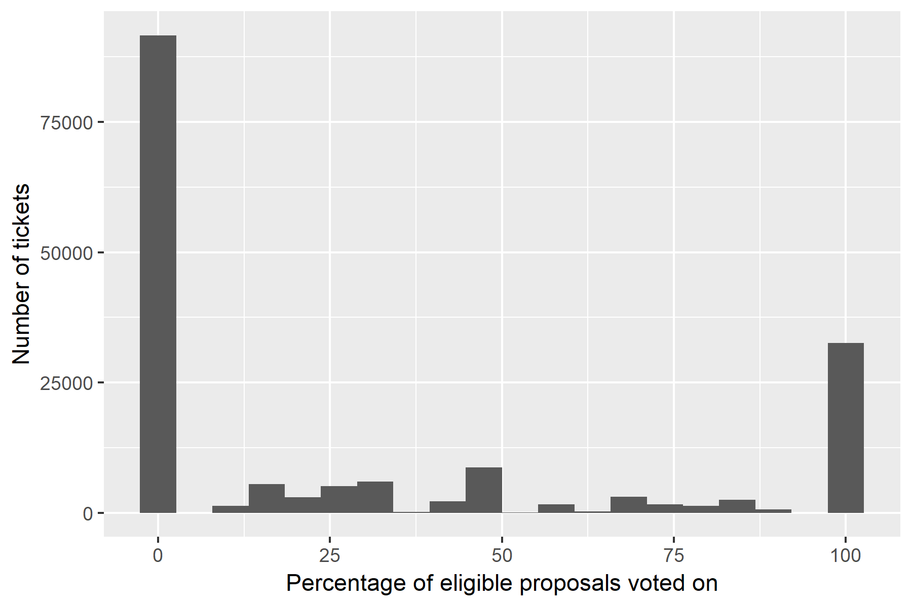
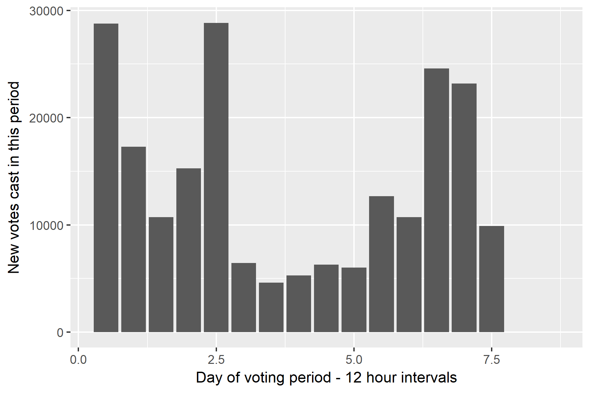
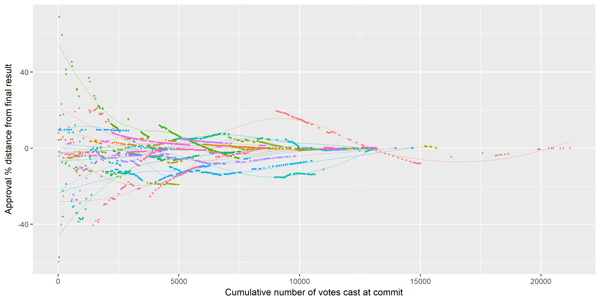

###  Do early ticket votes influence the outcomes of Politeia proposals?

Politeia proposal voting is transparent, the votes of individual tickets are recorded and tallied in real-time such that voters know over the course of the voting period how other stakeholders have voted. It has been suggested that early votes may influence the behavior of later voters, and that some actors may be deliberately voting early with large blocks of tickets for the purpose of influencing the other stakeholders' votes.

This question is worthy of some investigation because there are technical steps Decred could take to make voting private, but there are significant costs, challenges and tradeoffs associated with these.  

With 17 proposals having concluded voting so far, there is not enough data to look for a statistically significant effect of early votes on later voting behavior or outcomes. It is possible however to describe how this influence might occur, and to look at the data generated so far to see if any patterns can be identified.

#### Mechanisms through which the current state of a vote may affect prospective voters

The current state of a vote may affect stakeholders who have not yet voted by:

1. Influencing their perception of whether the proposal should be approved.
2. Influencing their perception of whether it is worth their effort to vote.

The first is difficult to probe from the voting data itself because it is hard to know whether early votes changed the mind of some stakeholders on how they should vote. We can only look at whether the early votes were in the same or a different direction than subsequent votes. The second is more tractable with the voting data because we can define scenarios where a stakeholder's votes are more or less likely to affect the outcome.

There is a cost associated with making a vote on a Politeia proposal, the ticket holder must 1) open the wallet which controls their tickets and 2) sign their votes. The cost of step 1 depends on the security setup of the stakeholder, being greater for people for whom it takes longer to open their wallet. Step 2, in Decrediton at least, involves clicking through to the page for each proposal, making a selection and entering the wallet's passphrase (there is an open [issue](https://github.com/decred/decrediton/issues/1751) about simplifying the process of voting on multiple proposals).

There are some stakeholders who vote on (almost) every proposal, likely because they see it as being part of their role as a stakeholder and in the interests of the project's general health. The chart below represents every ticket that has been eligible for at least one Politeia proposal, showing the proportion of eligible proposals they have voted on. For example, a ticket that was eligible to vote on 4 proposals and voted on 2 has a percentage of 50%.

A total of 168,047 tickets have been eligible to vote on at least one Politeia proposal, of those 55% have not voted at all, 26% have voted on some proposals, and 19% have voted on all proposals which they were eligible for. Within that final group are 14 tickets that have voted on each of the 17 proposals that have so far finished voting.

For stakeholders who vote some of the time (57% of those who vote at all), whether to vote on a specific proposal depends on whether they perceive it as being worth the associated effort. This will likely be determined by an interaction of how strongly they feel about the proposal and whether they perceive their votes as likely to make a difference to the outcome. If the stakeholder does not have strong feelings about a proposal, and the outcome of the vote seems like it will go the way they would prefer, then it is more likely that they will not vote.

There are two requirements for proposals to pass, and two associated ways in which a stakeholder's votes matter:

1. The proposal must achieve an approval rate of 60%. Hypothesis: Proposals that have a current approval rate closer to 60% are more likely to be voted on, as more prospective voters will perceive their tickets as potentially making a difference.
2. The proposal must achieve a quorum of 20% of all eligible tickets voting on it. Hypothesis: Proposals with strong/weak approval rates are more likely to receive votes if they have not yet reached the quorum requirement, as people who want the proposal to be conclusively approved/rejected still have a reason to vote and a mechanism through which their votes may make a difference. 

Any effect of proposals not having reached the quorum requirement on number of votes cast will be complicated by the way the quorum is defined - stakeholders who do not wish to see a proposal pass are incentivized to not vote if the approval rate is already high but the proposal may not reach the quorum requirement. See this [document](https://github.com/RichardRed0x/pi-research/blob/master/analysis/voting/quorum-change-examples.md) for a more detailed exploration of how the quorum requirement works and how it could be modified.

#### Temporal dynamics of Politeia voting

For the proposals that have finished voting so far, the first third of the voting window (2.5 days) is when 48% of the votes have been cast, followed by a lull in the middle third (14% cast between 2.5 and 5 days in) and a spike again towards the end of the voting period (38% after the 5th day).

I have fitted some Poisson regression models to see if the state of the proposal 2/3rds of the way through the voting period can predict the number of votes cast in the final 3rd. There are significant effects whereby 1) proposals that are closer to 60% approval after 5 days see more votes in the final third, and 2) proposals that have already met the quorum requirement after 5 days see fewer votes in the final third of the voting period. The sample size of 17 proposals is not big enough to put much weight on the strength of these effects.

#### Do early votes reflect voting outcomes?

This graph shows how far from the final approval percentage the tally was after each commit (hour), with points for every proposal coloured according to their proposal. The lines are loess smoothers, to diminish some of the noisiness in the data. This graph is admittedly hard to read, but it contains quite a lot of information. For every proposal so far, once 2,500 votes had been cast the approval percentage was within 20% of the final result. After 5,000 votes were cast, 12 of the 17 proposals were within 10% of their final approval score. 

It is more common for proposals to have an approval percentage that is lower than the final outcome while voting is open. The chart below shows all data about whether the tally at a given commit predicted the voting outcome for each of the 17 proposals (some proposals have a lower number of commits because if they were not voted on in an hour they do not have a commit for that hour). The result as it stands after around 10 commits/hours is almost always predictive of the final result. It has been particularly rare for a proposal to have an approval score greater than 60% during the voting period and then fail to reach 60% at the end of the voting period.

#### Follow up questions:

Do tickets tend to vote on all open proposals at the same time?

Do tickets tend to vote at the same stage in a voting period? e.g. always early/late?

Can tickets be clustered based on their proposal voting? i.e. did tickets that voted Yes on prop X vote no on props Y and Z?

 