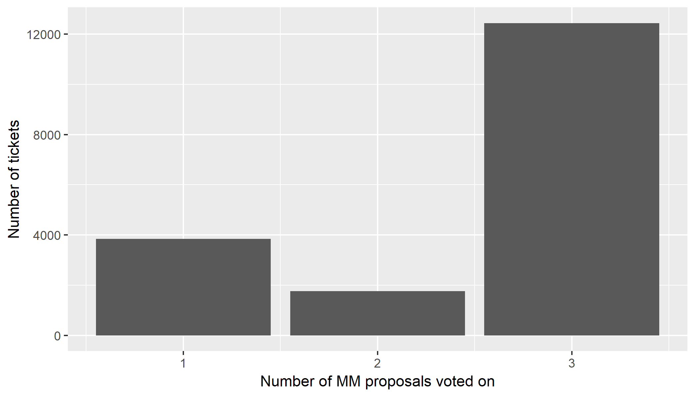

# Market Maker proposal voting - interim analysis

This version uses data from this [commit](https://github.com/decred-proposals/mainnet/commit/b5b2c73504b199c44e679e9045ac56df9219fb73), 1820 UTC on 2019-09-06, i2 Trading is on 61% approval, Grapefruit on 18% and Tantra on 57%. This document will be updated as the voting period progresses.

This analysis considers the voting on market maker proposals, looking at the number of proposals each participating ticket is voting on and at patterns within that voting. The aim is to see if there are any differentiating features between the supporters of the various proposals.

This bar chart shows the number of tickets that have voted on 1, 2 or 3 of the proposals so far. 

251 tickets (4.57%) have voted No on all proposals.
66 tickets (1.2%) have voted Yes on all proposals.

I have also looked at the other votes of the set of tickets that votes Yes on each proposal - i.e. the first graph shows how the tickets that voted Yes for i2 Trading voted (or not) on the other proposals. 

Among tickets that votes Yes on i2, there is an even split between Yes/No/Didn't vote on Tantra, and most have not voted on Grapefruit, or voted No.

Virtually all of the tickets that voted Yes on Tantra also voted on i2, with more voting No than Yes. Most Tantra-supporting tickets voted No on Grapefruit

I also looked at the previous voting of the tickets that voted Yes to each proposal. For this I am using the number of previous proposals (not one of these 3 proposals) that the ticket voted on as an indicator of how involved that ticket has been in Decred's governance. Tickets of different ages will have had different numbers of opportunities to vote on proposals prior to this, but when averaging over thousands of tickets this should balance out.

The tickets that voted Yes to Grapefruit had voted on a mean 1.3 proposals previously.
The tickets that voted Yes to i2 Trading had voted on a mean 1.14 proposals previously.
The tickets that voted Yes to Tantra Labs had voted on a mean 1.2 proposals previously.